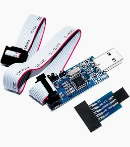

# USBasp NG

Firmware for the cheap, widespread USBasp AVR programmer (blue stick + 10-pin ribbon; often ships with a small adapter board):



- **Protocol:** Fischl USBasp 2011 (what avrdude speaks)
- **ISP/TPI internals:** dioannidis / nerdralph fixes, without their composite USB identity on the default image
- **Build:** CMake + avr-gcc, one **board profile** per configure

## Classic vs USBHID

Two separate firmware products. Same ISP/TPI wire protocol (L1/L2). Different USB identity (L0). Classic sources never mention HID; USBHID lives in `firmware/src_hid/` only.

```
firmware
   ├─ usbasp          classic — drop-in programmer (WinUSB / Arduino)
   └─ usbasp-hiduart  USBHID  — research/dev + Diagnostics Plane (not a Windows daily driver)
```

| | Classic (`usbasp`) | USBHID (`usbasp-hiduart`) |
|---|---|---|
| USB shape | Vendor class `0xFF`, EP0 only, no serial; BOS + MS OS 2.0 → WinUSB | Composite: WinUSB vendor IF0 + HID (EP1 UART optional, **EP2 diagnostics**) |
| Host programmer | Stock avrdude / AVRDUDESS `-c usbasp` **and** `-c usbasp-clone` | Same FUNC 1–16 / 127 on the wire; **Windows hosts often fail to program** even when drivers bind |
| **Primary goal** | Reliable everyday ISP (zero telemetry cost) | **Diagnostics Plane** — SESSION / SCK / RESET / ENABLEPROG / snapshots on EP2 |
| Secondary | — | iSerial in EEPROM; optional HID↔USART on PD0/PD1 (or the kit’s TXD/RXD adapter — not the ISP ribbon alone; [KNOWN_ISSUES](docs/KNOWN_ISSUES.md)) |
| Size (ATmega8) | ~5610 B | ~8040 B (`USBASP_HAS_DIAG=1`, MEMOP markers) |
| Role | **Default release** — Windows 10/11 + Arduino | Linux lab stick for SW-SCK / ENABLEPROG investigation |

### Windows (what works)

| Firmware | Driver / Device Manager | AVRDUDESS / avrdude ISP |
|----------|-------------------------|-------------------------|
| **Classic** | WinUSB binds cleanly | Works with **`usbasp`** and **`usbasp-clone`** |
| **HIDUART** | Drivers often install (WinUSB IF0 + HID) | **Does not work properly** as a programmer on typical Windows setups (AVRDUDESS, MSVC avrdude). Use classic to flash targets |

**Windows / Arduino:** flash **classic** only. Acceptance: [`docs/acceptance/ACCEPTANCE-WIN11-USBASP-001.md`](docs/acceptance/ACCEPTANCE-WIN11-USBASP-001.md). Matrix: [`docs/WINDOWS.md`](docs/WINDOWS.md). Arduino: [`docs/ARDUINO.md`](docs/ARDUINO.md). Open gate: software SCK on some targets ([`ACCEPTANCE-SCK-SWEEP-001`](docs/acceptance/ACCEPTANCE-SCK-SWEEP-001.md)).

Classic must not grow HID, interrupt endpoints, EEPROM serial, or diagnostics. BOS/MS OS 2.0 on classic is host-driver metadata only ([`docs/COMPATIBILITY.md`](docs/COMPATIBILITY.md)).

**HIDUART purpose:** instrumented stick for diagnostics beside a scope/FX2 — not a Windows daily programmer and not a target `printf` console on the ISP ribbon alone. Design: [`docs/DIAGNOSTICS.md`](docs/DIAGNOSTICS.md). Lab: `host/usbasp-diag-monitor.py`. Rust: `cd tools/usbasp-ng-diag && cargo run --release -- monitor YEL0` ([`docs/DIAGNOSTICS_CLIENT.md`](docs/DIAGNOSTICS_CLIENT.md)).

```text
# live ENABLEPROG / SCK / RESET stream (yellow HIDUART in USB)
python3 host/usbasp-diag-monitor.py YEL0
# other terminal:
avrdude -c usbasp -p m328p -B 8  -U signature:r:-:h
avrdude -c usbasp -p atmega8 -B 22 -U signature:r:-:h   # compare SW path
```

## Build

Needs `avr-gcc`, `avr-libc`, CMake, and either Ninja or `make`.

Lightweight (from the repo root; reuses an existing build dir, otherwise Ninja if present):

```text
./scripts/build.sh                 # classic ATmega8 clone
./scripts/build.sh hiduart         # USBHID composite
SERIAL=YEL0 ./scripts/build.sh usbhid
./scripts/build.sh --help
```

Hex lands in `firmware/build/<board>/usbasp.hex` or `usbasp-hiduart.hex`.

Full wrapper (tests, flash, every board) still lives in `firmware/`:

```text
cd firmware
make BOARD=usbasp-atmega8-clone
make BOARD=usbasp-atmega88
make BOARD=usbasp-atmega8-usbisp
make BOARD=usbasp-hiduart-atmega8
make all-boards
make test
```

Or CMake directly (Ninja if you have it):

```text
cmake -S firmware -B firmware/build/clone -G Ninja -DBOARD=usbasp-atmega8-clone
cmake --build firmware/build/clone
```

Board files: [`firmware/boards/`](firmware/boards/). They set MCU, F_CPU, LED style, SCK jumper, 3 MHz, classic vs USBHID. Do not pile ad-hoc `-DTHIS=1` flags.

## Flash (another programmer, J2 / RESET)

ATmega8 example:

```text
avrdude -c <isp> -p atmega8 -U flash:w:usbasp.hex:i
```

Do not program fuses unless you mean to. Fischl 2011 documents `hfuse=0xc9 lfuse=0xef`; cheap clones on this bench already had `hfuse=0xd9 lfuse=0xef`. `make fuses` is blocked until `CONFIRM_FUSES=1`.

ATmega88 (if you actually need fuses): `hfuse=0xdd` `lfuse=0xff`.

## avrdude (this programmer)

**no-dot** — clone with NG classic, USB to the host (`-c usbasp`).  
**yellow-dot** — experiment target: same ATmega8 clone on the ISP header (J2 closed). Flash HIDUART and other trials only onto yellow-dot.

```text
avrdude -c usbasp -p atmega8
avrdude -c usbasp -p atmega8 -U signature:r:-:h
```

Checklist: [`firmware/tests/compatibility/avrdude/hw-smoke-atmega8.txt`](firmware/tests/compatibility/avrdude/hw-smoke-atmega8.txt), 328P: [`hw-smoke-atmega328p.txt`](firmware/tests/compatibility/avrdude/hw-smoke-atmega328p.txt).

```text
avrdude -c usbasp -p atmega328p -U flash:w:firmware.hex:i
```

From `firmware/`: `make flash` writes the hex onto a USBasp (J2 closed) using another USBasp. HIDUART `make flash` then writes EEPROM `SERIAL` in the same recipe — avrdude chip-erase wipes EEPROM on clones without EESAVE (`hfuse 0xd9`). Do not run `flash` and `eeprom` in parallel. Linux udev: [`host/udev/70-usbasp.rules`](host/udev/70-usbasp.rules) (`usb` for avrdude plus `hidraw` for HIDUART). Inspect: [`host/usb-inspect-usbasp.sh`](host/usb-inspect-usbasp.sh), [`host/usbaspctl.py`](host/usbaspctl.py) (`info`), [`host/usbasp-getcaps.py`](host/usbasp-getcaps.py). Diagnostics (HIDUART EP2): [`host/usbasp-diag-monitor.py`](host/usbasp-diag-monitor.py), [`host/usbasp-hidraw-log.py`](host/usbasp-hidraw-log.py), [`host/usbasp-trace.py`](host/usbasp-trace.py). HIDUART status: [`host/usbasp-hiduart-status.py`](host/usbasp-hiduart-status.py). Optional USART loopback: [`host/usbasp-hiduart-loopback.py`](host/usbasp-hiduart-loopback.py) (TQFP 30–31).

On Windows, do **not** expect HIDUART to program chips (AVRDUDESS included): drivers may look fine while ISP fails. Keep **classic** on the stick you use under Windows; flash HIDUART for Linux diagnostics when needed.

HIDUART USB serial is 4 characters in EEPROM (`make BOARD=usbasp-hiduart-atmega8 SERIAL=YEL0 eeprom`). Classic has no serial. Bench yellow-dot uses `YEL0`.

## Compatibility

See [docs/COMPATIBILITY.md](docs/COMPATIBILITY.md), [docs/KNOWN_ISSUES.md](docs/KNOWN_ISSUES.md), [docs/USB_DESCRIPTORS.md](docs/USB_DESCRIPTORS.md), [docs/USB_WINDOWS.md](docs/USB_WINDOWS.md), and [docs/USB_EXECUTION.md](docs/USB_EXECUTION.md). Short version:

- VID/PID `16c0:05dc`, FUNC 1–16 and 127
- GETCAPABILITIES = TPI + 3 MHz bit, **not** dioannidis clock bytes
- Default SCK 1.5 MHz with auto-slowdown (same SETISPSCK wire)

**Known issues:** [docs/KNOWN_ISSUES.md](docs/KNOWN_ISSUES.md) (Arduino notes; SW SCK target-dependent; **HIDUART not a Windows programmer**; USART needs adapter/leads; TPI off). Protocol/FSM RC1: [docs/acceptance/RC1-PROTOCOL-FSM.md](docs/acceptance/RC1-PROTOCOL-FSM.md). **HIDUART diagnostics:** [docs/DIAGNOSTICS.md](docs/DIAGNOSTICS.md), client: [docs/DIAGNOSTICS_CLIENT.md](docs/DIAGNOSTICS_CLIENT.md).

Hex for ATmega8 clone and HIDUART, plus Linux x86-64 `diagplane.bin`: [Releases](https://github.com/minerdear0-jpg/usbasp_ng/releases). Packaging: [`docs/RELEASE.md`](docs/RELEASE.md) (`./scripts/pack-release.sh VERSION --hex --diag`).

Still waiting on silicon (not blocking the protocol): ATmega328P ISP target, ATtiny10 TPI (`-p t10`). Checklists: [`hw-smoke-atmega328p.txt`](firmware/tests/compatibility/avrdude/hw-smoke-atmega328p.txt), [`hw-smoke-tpi.txt`](firmware/tests/compatibility/avrdude/hw-smoke-tpi.txt).

## Trees

| Path | Role |
|------|------|
| [`firmware/`](firmware/) | Only build input |
| [`reference/`](reference/) | Immutable Fischl 2011 and dioannidis snapshots |
| [`docs/`](docs/) | Compatibility contract |

`usbasp.2011-05-28/` and `dioannidis/` in the working tree (if still present) are leftovers from import; prefer `reference/`.

## License

GPLv2, same as USBasp / V-USB. V-USB remains under its own license files in `firmware/third_party/vusb/`.
